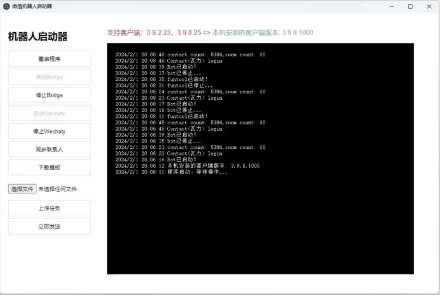

# Sidecar Launcher

## 简介
 
WeChat机器人一键启动器，已支持功能：

- 导出联系人
- 下载模板
- 群发消息

项目语雀知识库 [https://www.yuque.com/atorber/chatflow/oe1alyh5zdzwr4st](https://www.yuque.com/atorber/chatflow/oe1alyh5zdzwr4st)

客户端百度网盘链接：https://pan.baidu.com/s/1NgaNrT8GkeqPPXAPYLdSEA?pwd=5lvw 提取码：5lvw

## 快速开始

1. 下载sidecar-launcher客户端，百度网盘链接：https://pan.baidu.com/s/1NgaNrT8GkeqPPXAPYLdSEA?pwd=5lvw 提取码：5lvw
2. 登录微信并检查微信版本为v3.9.2.23或v3.9.8.25，会自动检查微信版本，如果不是则不能启动Bridge，需要下载并安装对应版本的微信（下载微信客户端：下载v3.9.2.23 下载v3.9.8.25）
3. 解压缩文件夹，启动sidecar-launcher.exe
4. 点击【启动Bridge】，等待Bridge启动，如果是3.9.2.23会弹出funtool界面，需要点击【start】
5. 点击【启动Wechaty】
6. 点击【同步联系人】下载通讯录到本机
7. 点击【下载模板】，保存模板并更新模板的text列为你要发的信息，不需要发消息的好友可以保留也可以删除
8. 选择改好的文件，点击【上传任务】
9. 查看任务信息，点击【立即发送】即立即群发消息

> 特别提示：在正式群发前可以选择1~2个好友进行测试发送



## 运行与编译

1. 安装cnpm

```shell
npm install -g cnpm --registry=https://registry.npmmirror.com
```

2. 安装electron和electron-packager

```shell
cnpm install electron --save-dev
cnpm install electron-packager --save-dev
```

3. 调试运行 npm run start
